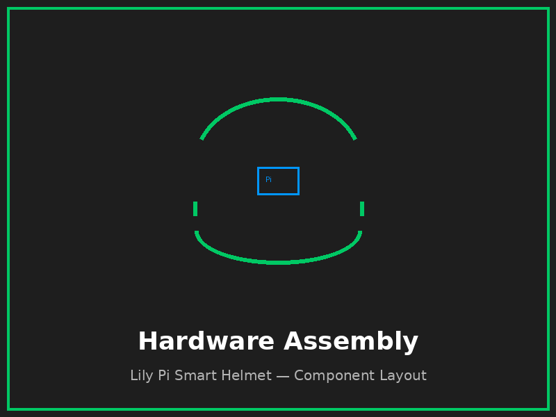

# 🪖 Lily Pi — Modular AR/AI Smart Helmet HUD

> **Powered by [Enki AI](https://github.com/Cassai2026/Enki)** · Open-source · Python 3 · Raspberry Pi / NVIDIA Jetson

[](LICENSE)
[](LICENSE)
[](https://www.python.org/)
[]()

---

## 🌟 Vision

**Lily Pi** is a fully open-source, modular heads-up display (HUD) system designed to run on a helmet.
It combines augmented-reality overlays, real-time AI assistance (via **Enki AI**), and maker-friendly
hardware so that anyone — from weekend tinkerers to advanced robotics engineers — can build their own
intelligent wearable.

**Core pillars:**
- 🧠 **AI-first** — Enki AI inference runs locally or over a lightweight API for voice, vision, and navigation
- 📡 **Modular** — swap sensors, displays, and AI modules without rewiring the whole helmet
- 🛠 **Open hardware** — printable 3-D mounts, open wiring diagrams, and a full BOM
- 🐍 **Python 3** codebase ready for Raspberry Pi 4/5 and NVIDIA Jetson Nano/Orin

---

## ✨ Features

| Feature | Description |
|---|---|
| HUD Runner | Main event loop that reads sensors and pushes to display |
| Enki AI Bridge | Lightweight client to query Enki AI for navigation, hazard alerts, and voice |
| OLED / NeoPixel Display | Ready-to-run display example (SSD1306 OLED & RGB LED ring) |
| 3-D Printable Mounts | STL / STEP files for common helmets (bike, moto, industrial) |
| Wiring Diagrams | Fritzing + PDF schematics for every sensor module |
| Safety & Legal | Built-in disclaimers and safety guide for road-legal use |

---

## 🗺 System Diagram

```
┌─────────────────────────────────────────────┐
│                  Helmet Shell                │
│                                             │
│  ┌──────────┐   ┌──────────┐  ┌──────────┐ │
│  │  IMU /   │   │  Camera  │  │  Mic /   │ │
│  │  GPS     │   │  Module  │  │  Speaker │ │
│  └────┬─────┘   └────┬─────┘  └────┬─────┘ │
│       └──────────────┼─────────────┘        │
│                      │ I²C / UART / USB      │
│              ┌───────▼────────┐             │
│              │  Raspberry Pi  │             │
│              │  (or Jetson)   │             │
│              └───────┬────────┘             │
│          ┌───────────┼───────────┐          │
│    ┌─────▼──┐  ┌─────▼──┐ ┌─────▼──┐       │
│    │ OLED   │  │  Enki  │ │ LED    │       │
│    │  HUD   │  │ AI API │ │  Ring  │       │
│    └────────┘  └────────┘ └────────┘       │
└─────────────────────────────────────────────┘
```

---

## 🚀 Quick Start

### 1. Clone the repository

```bash
git clone https://github.com/Cassai2026/Lily-Pi.git
cd Lily-Pi
```

### 2. Install Python dependencies

```bash
pip install -r software/requirements.txt
```

### 3. Connect your hardware

See **[docs/getting-started.md](docs/getting-started.md)** and the
**[hardware/wiring-diagrams/](hardware/wiring-diagrams/)** folder for wiring instructions.

### 4. Run the HUD

```bash
python software/hud_runner.py
```

> **Tip:** Set `ENKI_API_URL` in a `.env` file or as an environment variable to point to your
> Enki AI instance. See [software/enki_bridge.py](software/enki_bridge.py) for details.

---

## 📁 Repository Structure

```
Lily-Pi/
├── hardware/
│   ├── 3d-models/          # STL / STEP printable mounts & enclosures
│   ├── wiring-diagrams/    # Fritzing and PDF schematics
│   ├── bom.md              # Full Bill of Materials
│   └── helmet-integration-guide.md
├── software/
│   ├── hud_runner.py       # Main HUD event loop
│   ├── enki_bridge.py      # Enki AI integration client
│   ├── display_example.py  # OLED + LED ring demo
│   └── requirements.txt
├── docs/
│   ├── getting-started.md
│   ├── safety-and-legal.md
│   └── contributing.md
├── images/
│   ├── hardware-assembly.png
│   └── ui-mockup.png
├── LICENSE                 # MIT
└── README.md
```

---

## 🤖 Enki AI Integration

Lily Pi pairs with the **[Enki AI](https://github.com/Cassai2026/Enki)** engine for on-device and
cloud-assisted intelligence. The `enki_bridge.py` module provides:

- `query(prompt)` — text/voice prompt to Enki
- `vision_query(image_bytes, prompt)` — multimodal vision queries
- Automatic retry / offline fallback

Set `ENKI_API_URL` to `http://localhost:8080` for fully local operation.

---

## 📸 Hardware Preview

| Assembly | UI Mockup |
|---|---|
|  |  |

---

## 🤝 Contributing

We welcome contributions from makers, engineers, and AI researchers. Please read
**[docs/contributing.md](docs/contributing.md)** before opening a PR.

**Quick contribution steps:**
1. Fork the repo
2. Create a feature branch (`git checkout -b feat/my-feature`)
3. Commit your changes (`git commit -m 'feat: add my feature'`)
4. Push and open a Pull Request

---

## ⚠️ Safety & Legal

Before building or wearing this device, read **[docs/safety-and-legal.md](docs/safety-and-legal.md)**.  
This is experimental open-source hardware. **Use at your own risk.**

---

## 📜 License

Lily Pi uses a **dual license** — see [LICENSE](LICENSE) for the full text.

| Scope | License |
|-------|---------|
| Software (`software/`) | [GNU AGPL-3.0](https://www.gnu.org/licenses/agpl-3.0.txt) |
| Docs, hardware & images (`docs/`, `hardware/`, `images/`, `README.md`) | [CC BY-SA 4.0](https://creativecommons.org/licenses/by-sa/4.0/) |

© 2026 Cassai2026 / Lily-Pi Contributors
